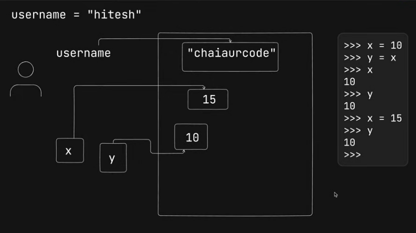

## Mutable and Immutable

Even after we have updated value of `x` to 15, `y` is still 10, cuz object `y` is still pointing to reference of 10. When we say `y=x`, `x` is pointing to the reference of 10, similarly `y` will also point to the reference of 10.